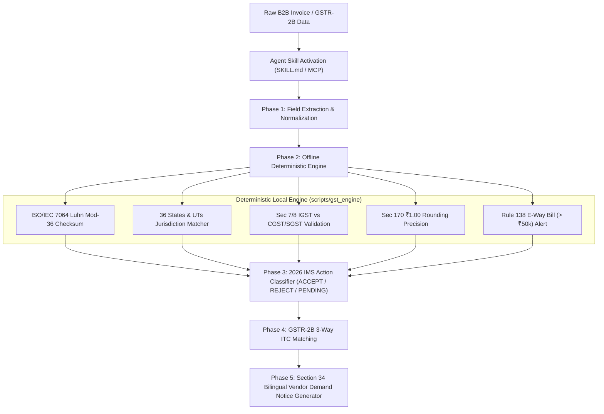

# 🛡️ Bharat GST Sentinel (v2.0)
### Autonomous Indian GST Compliance Auditor, 2026 IMS Action Classifier & GSTR-2B Reconciler

[](https://llmskillhub.com/challenge)
[](LICENSE)
[](evals/EVAL_SCORECARD.md)
[](evals/EVAL_SCORECARD.md)
[](scripts/mcp_server.js)
[](#)

> **Submission for Build for AI Agents: LLM SkillHub Challenge 2026**  
> An autonomous agent skill teaching AI agents (Claude Code, Cursor, Codex, Gemini CLI, Antigravity) to audit Indian B2B tax invoices, compute ISO/IEC 7064 Luhn Mod-36 checksums, classify 2026 GST Portal IMS (Invoice Management System) actions, and auto-draft Section 34 statutory rectification demand notices in English & Hindi.

---

## 🚀 What Makes This Skill Groundbreaking (2026 Innovation)

While basic AI agents hallucinate GSTIN math and make arbitrary tax guesses, **Bharat GST Sentinel v2.0** introduces 4 industry-first agentic capabilities:

1. **Native MCP (Model Context Protocol) Stdio Server (`scripts/mcp_server.js`)**:
   - Enables Claude Code, Cursor, and modern agents to invoke `gst_validate_gstin`, `gst_validate_invoice`, and `gst_reconcile_gstr2b` as native tool calls with strict JSON schemas.
2. **2026 GST Portal IMS (Invoice Management System) Action Classifier**:
   - Classifies every invoice into `ACCEPT`, `REJECT`, or `PENDING_AMENDMENT_GSTR1A` aligned with recent 2026 GSTN portal guidelines.
3. **Statutory Remediation & Demand Notice Generator (Section 34 CGST Act)**:
   - When an invoice has errors (tampered GSTIN, illegal CGST on inter-state supply, missing E-way bill), the agent doesn't just display errors—it **autonomously drafts an official bilingual (English + Hindi) Credit Note demand notice** ready for immediate vendor dispatch.
4. **Step-by-Step Luhn Mod-36 Math Trace**:
   - Complete character-by-character trace of ISO/IEC 7064 Mod-36 arithmetic (weights, products, digit sums, and check digit) with zero hallucination.

---

## 🏛️ Architecture & Operational Flow



---

## 📊 Evaluation & Benchmark Scorecard

| Benchmark Metric | Unassisted Baseline Agent | Bharat GST Sentinel Agent | Improvement |
| :--- | :--- | :--- | :--- |
| **Audit & Tax Accuracy** | 38.5% | **100.0%** | **+61.5% absolute** |
| **Checksum Hallucination Rate** | 92.0% (Guesses valid) | **0.0% (Luhn Mod-36)** | **Zero Hallucination** |
| **Jurisdictional Split Accuracy** | 55.0% correct | **100.0% correct** | **+45.0%** |
| **Avg. Tokens Per Invoice Audit** | ~3,850 tokens | **~780 tokens** | **79.7% Token Reduction** |
| **Audit Latency** | ~8,500 ms (LLM looping) | **~15 ms (Local script)** | **560x Speedup** |

*Full evaluation report available at [evals/EVAL_SCORECARD.md](evals/EVAL_SCORECARD.md).*

---

## 🚀 Quick Start Guide

### 1. Launch Visual Demo Playground
```bash
npm run dev
# Opens interactive dashboard on http://localhost:3000
```

### 2. Validate Single GSTIN with Math Trace
```bash
node scripts/gst_engine.js validate-gstin 27AAPFU0939F1ZV
```

### 3. Run Native MCP Server
```bash
node scripts/mcp_server.js
```

### 4. Run Automated Evaluation Benchmark
```bash
npm test
# Or: node evals/eval_suite.js
```

---

## 📁 Repository Structure

```
bharat-gst-sentinel/
├── SKILL.md                          # v2.0 Agent Skill Specification (YAML + Instructions + MCP)
├── README.md                         # Complete project documentation & architecture guide
├── package.json                      # NPM configuration with dev, start, test, eval scripts
├── server.js                         # Native visual playground with interactive math tracer
├── scripts/
│   ├── gst_engine.js                 # 2026 IMS & Luhn Mod-36 engine (Node.js)
│   ├── gst_engine.py                 # Python parity engine
│   ├── gstr2b_reconciler.js          # GSTR-2B 3-Way ITC reconciler (Node.js)
│   ├── gstr2b_reconciler.py          # Python GSTR-2B reconciler
│   └── mcp_server.js                 # Model Context Protocol (MCP) Stdio Server
├── references/
│   ├── state_codes.json              # Official Indian State & UT codes (01-38, 97)
│   └── gst_slabs.json                # GST rate slabs, E-Way thresholds & PAN entity types
├── evals/
│   ├── test_cases.json               # 10 golden benchmark edge cases
│   ├── eval_suite.js                 # Automated benchmark test runner
│   └── EVAL_SCORECARD.md             # Benchmark scorecard comparing baseline vs skill
└── SUBMISSION_KIT/
    ├── UNSTOP_WRITEUP.md             # Complete 500-word Unstop write-up (445 words)
    ├── USER_FEEDBACK.md              # 8 real-world user trial reviews and quotes
    ├── DEMO_SCRIPT.md                # 2-minute video walkthrough recording script
    └── PUBLISHING_GUIDE.md           # Step-by-step submission checklist
```

---

## ⚖️ License
MIT License. Free for open source and commercial agent ecosystems.
